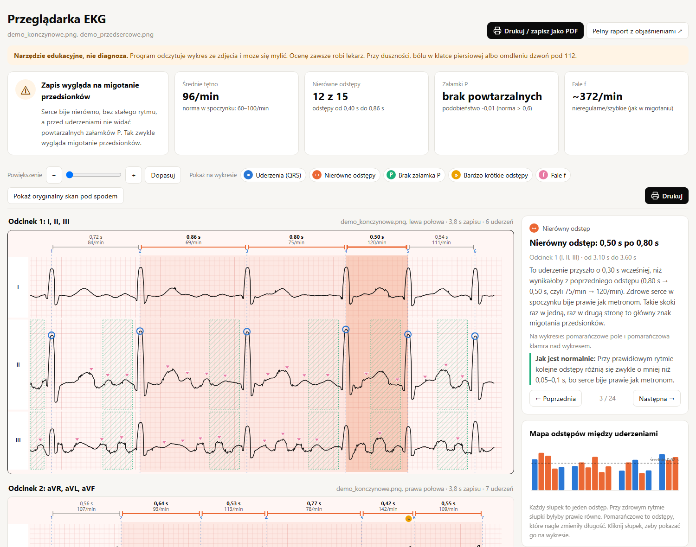

# paper-ecg-explainer

**Turn a scanned or photographed paper ECG into an interactive, plain-language explanation of the heart rhythm.**


> [!CAUTION]
> **Educational project only. This is NOT a medical device and NOT a diagnostic tool.**
>
> - It has not been clinically validated and can be wrong, both by missing a problem and by flagging one that is not there.
> - Do **not** use it to diagnose, treat, or decide anything about anyone's health.
> - Always have an ECG interpreted by a qualified physician. In an emergency (chest pain, shortness of breath,
>   fainting, very fast heartbeat) call your local emergency number (112 in the EU).
>
> **PL:** Projekt wyłącznie edukacyjny. **To nie jest wyrób medyczny ani narzędzie diagnostyczne.** Może się mylić.
> Nie używaj go do stawiania diagnozy ani podejmowania decyzji o leczeniu. EKG zawsze ocenia lekarz.
> W nagłym wypadku dzwoń pod 112.


<sub>Screenshot generated from a **fictional, synthetic** ECG (see [`demo/`](demo)), not from a real patient.</sub>

## Why

ECG printouts are hard to read if you are not a doctor: a red grid, spikes, cryptic labels like *aVR* or *V1*.
This project started from a simple wish to understand what such a chart actually shows. The first working
version was built in about 30 minutes with [Claude Code](https://claude.com/claude-code).

The user interface and the reports are in **Polish**; the code is commented in Polish as well.

## What it does

1. **Digitizes the paper printout:** detects the red grid, straightens a skewed scan, measures the 1 mm pitch
   (25 mm/s, 10 mm/mV) and traces the line of every lead, skipping labels and the calibration pulse.
2. **Finds heartbeats:** detects QRS complexes by fusing the slope energy of all leads recorded at the same time.
3. **Looks for rhythm anomalies:**
   - irregular RR intervals (sudden changes from one beat to the next),
   - very short intervals (rate above 120/min) and long pauses,
   - missing repeatable P waves before the beats,
   - fibrillatory "f" waves between the beats (QRST cancellation + spectrum: dominant frequency and organization index).
4. **Opens an interactive viewer** (`przegladarka_ekg.html`, one offline HTML file):
   - all 12 leads redrawn on an ECG-paper grid with the anomalies marked on the trace,
   - hover for a tooltip, click for a plain-language explanation and *"what normal looks like"*,
   - clickable anomaly list, RR interval map, zoom, ← / → to step through anomalies,
   - overlay of the original scan to check the digitization.
5. **Prints:** a print-ready PDF (`ekg_do_druku.pdf`, A4 landscape) with numbered anomalies, legend, anomaly table
   and a glossary of ECG symbols. The viewer also has a print button with the same layout.
6. **Writes a longer report** (`raport_ekg.html`) explaining ECG basics with synthetic "normal vs. AF" examples.

## Quick start

```bash
pip install -r requirements.txt

# try it on the fictional demo recording
python demo/generuj_demo.py
python ekg_analiza.py demo/demo_konczynowe.png demo/demo_przedsercowe.png -o demo/wynik

# your own scans (limb leads first, chest leads second)
python ekg_analiza.py scan_limb_leads.jpg scan_chest_leads.jpg
```

The viewer opens in the browser automatically (`--nie-otwieraj` disables it). The PDF is rendered by a locally
installed Edge or Chrome in headless mode; without one, use the print button in the viewer.

### Supported printout layout

By default the tool expects the common 3-row × 2-column printout (e.g. AsCARD):

| file | left column | right column  |
|------|-------------|---------------|
| 1st  | I, II, III  | aVR, aVL, aVF |
| 2nd  | V1, V2, V3  | V4, V5, V6    |

Other lead orders can be named explicitly:

```bash
python ekg_analiza.py scan.jpg --odprowadzenia "I,II,III,aVR,aVL,aVF" -o results_folder
```

## Project layout

| file | role |
|------|------|
| `ekg_analiza.py` | command-line entry point, PDF export |
| `digitalizacja.py` | image → signal (grid detection, deskew, line tracing) |
| `analiza.py` | QRS detection, RR irregularity, P waves, atrial spectrum, anomaly list |
| `przegladarka.py`, `przegladarka.html` | interactive viewer (data builder + HTML/JS template) |
| `raport.py`, `wykresy.py` | longer HTML report with charts |
| `demo/generuj_demo.py` | generates fictional ECG scans for the demo |

## Limitations

- Only the few seconds printed on the paper are analyzed. The thresholds are heuristics from literature and
  have not been clinically validated.
- Digitization quality depends on the scan: folds, faint print or stamps showing through the paper can distort it.
- It looks at the **rhythm** only. It does not assess QRS morphology, ST segments, intervals (PR, QT) or
  anything else a physician checks.
- Only the 3×2 printout layout is supported for now.

## Privacy

Real ECG scans and the generated reports are git-ignored on purpose. They are personal medical data and should
never be committed. The only image in this repository is a screenshot made from the fictional demo recording.

## Medical disclaimer

This software is provided for educational and informational purposes only. It is not intended to be a substitute
for professional medical advice, diagnosis or treatment, and it is not a medical device under EU Regulation
2017/745 (MDR) or any other regulation. The authors accept no liability for any decision made based on its output.
